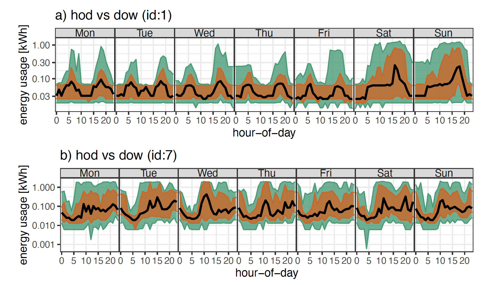

```{r setup, include=FALSE}
library(knitr)
options(htmltools.dir.version = FALSE, tibble.width = 55, tibble.print_min = 4)
opts_chunk$set(
  echo = FALSE, warning = FALSE, message = FALSE, comment = "#>",
  fig.path = 'figure/', cache.path = 'cache/', fig.align = 'center', 
  fig.width = 12, fig.show = 'hold', fig.height = 7, # 16:9
  cache = TRUE, external = TRUE, dev = 'svglite',
  results = "markup"
)
read_chunk('R/theme.R')
read_chunk('R/main.R')
```

```{r xaringan-themer, include = FALSE, eval=FALSE}
library(xaringanthemer)
 solarized_dark(
   header_font_google = google_font("Josefin Sans"),
   text_font_google   = google_font("Montserrat", "300", "300i"),
   code_font_google   = google_font("Droid Mono"),
   # header_color = "#00aba9",
   # text_color = "#2b5797"
   # # header_color = "#00008B",
   # text_color = "#8B4513"
  header_color = "#ffbb33",
  # text_color = "#FFDAB9",
  text_color = "White",
  background_color = "#555555",
  #title_slide_background_color = " #D9D690"
 )
```


```{r load}

```

# Outline


- .checked[.larger[Why?]]
- .checked[.larger[What?]]
- .checked[.larger[How?]]
  -  Methods
  -  Package usage

<br>

_**Methodology references**_

_.smaller[.smaller[.smaller[Gupta, S., Hyndman, R.J., Cook, D. and Unwin, A., 2022. Visualizing probability distributions across bivariate cyclic temporal granularities. Journal of Computational and Graphical Statistics, 31(1), pp.14-25]]]_

_.smaller[.smaller[.smaller[Gupta, S., Hyndman, R.J. and Cook, D., 2021. Detecting Distributional Differences Between Temporal Granularities for Exploratory Time Series Analysis (No. 20/21). Monash University, Department of Econometrics and Business Statistics.]]]_

---
# Why? 

```{r load-elecnew, message = FALSE, warning=FALSE}
```

```{r elec-rawnew, out.width="90%"}

```

.center[
.card[.smaller[Electricity demand series]]
.card[.smaller[many households]]
.card[.smaller[fine time resolutions]]
.card[.smaller[many measurements]]
.card[.smaller[no pattern visible in the squeezed linear view]]
.card[.smaller[different start and end date]]
.card[.smaller[missing observations]]
]


---
# Why? (continued)

Applicable to any temporal data collected more than once a year

- traffic sensors
- pedestrian movement data in metro stations
- public buildings, cab or bike rides
- Temperature or precipitation collected over time

or more broadly,

- data observed by years, decades, and centuries as might be astronomical data.

---

# What? 


.center[Visualize and analyze **probability distributions** to explore large quantities of temporal data across different **time deconstructions** to find **underlying patterns ** in behavior.]

???
Why probability distributions? Which time deconstructions can help find underlying patterns?

---
# What? (continued)

.pull-left[

.smaller[Which time deconstructions can help identifying patterns?  
    **Cyclic granularities:** e.g. hour-of-day, day-of-month or  hour-of-week, day-of-semester]
    <br>
 .smaller[Why probability distributions?  
   **Multiple observations** for each level of cyclic granularity  
   **summarize distribution** of measured variables]  
 
]

.pull-right[
```{r linear2cyclic, dev='png', interval=0.2}
```
]

---
# How? (package functions)

<!-- - describes classes of time deconstructions using linear and cyclic time -->
<!-- granularities.  -->
<!-- - provides tools to compute possible cyclic granularities from an ordered (usually -->
<!-- temporal) index -->
<!-- - check the feasibility of creating plots or drawing inferences for any -->
<!-- two cyclic granularities by identifying "harmonies" and "clashes" -->
<!-- - refining the search to obtain "significant" harmonies to find "significant" patterns -->
.smaller[
 
.pull-left[

### 1. Computation
--- 
- Compute any cyclic granularity? `create_gran()`
 <br>
- Exhaustive list of granularities to explore? `search_gran()`
 <br>
 <br>
 
### 2. Interaction
 --- 
- Check if cyclic granularities are harmonies/clashes? `is.harmony()`
<br>
- List of harmonies to explore? `harmony()`
<br>]

.pull-right[
### 3. Visualization
--- 
- Plot harmonies? `prob_plot()`
<br>
- Sufficient observations? `gran_obs()`
<br>
- Recommendations on feasibility? `gran_advice()`
<br>
### 4. Inference
--- 
- Select only interesting displays? `select_harmonies()`
<br>
- Rank interesting displays `rank_harmonies()`
]
 
]

---
class:left, top

#  Interaction between cyclic granularities

```{r clash, out.width="100%"}
```
```{r noclash, out.width="100%"}
```

```{r bothclash2, out.width="80%"}
```

.smaller[
.card[_Clashes_: pairs leading to empty sets]
.card[_Harmonies_: pairs leading to no empty sets]  
.smaller[
]
]

---

#  Inference

.left-column[
<br>
- Sample designs
- Rank harmonies $a<b<c<d$
- Gestalt theory
- distance to compute within and between facet variation
- define a threshold for significance
]

.right-column[
```{r example-design2, out.width="90%"}
```
]
.smaller[
.smaller[
.smaller[
**Designs:** 
$a \gets D_{null}$, $b\gets D_{var_f}$,  $c\gets D_{var_x}$, $d \gets D_{var_{all}}$
]
]
]

---

# Melbourne households example: show me the data

```{r linear-scale-8new}
```


---
#  Melbourne households example: systematic search

```r
elec %>% 
*  search_gran(lowest_unit = "hour",
*              highest_unit = "month", 
*              filter_in = "wknd_wday", 
*              filter_out = "fortnight")
```

```{r search-gran}

```
<br>

- There are $^{7} P_2 = 42$ pairs of granularities to look at looking at two at a time.
- 42 visualizations to interpret?

---
#  Melbourne households example: harmonies

```r
elec %>% 
*  harmony(ugran = "month",
*       filter_in = "wknd_wday",
*       filter_out = c("hhour", "fortnight")
```

```{r harmony}
```

.smaller[
- only 14 out of 42 are harmonies <br>
- plotting other 28 pairs lead to empty combinations
]

---
#  Melbourne households example: significant harmonies

```{r rank-table, out.width="60%"}
```
.smaller[
- Only 2 or 3 harmony pairs out of 14 are significant for any household 
- Significant pairs differ across households
]
---
#  Melbourne households example: compare households
.left-column[
.checked[
.smaller[
something
]
]
]
.right-column[
```{r, out.width="73%"}
knitr::include_graphics("figure/tilemap-withlabel.png")
```
]

---
#  Melbourne households example: compare households

.left-column[
.checked[
.smaller[
something
]
]
]
.right-column[
```{r, out.width="100%"}

```
]

---
# More Information

Package : https://github.com/Sayani07/gravitas  
Slides : https://sayani.netlify.app/dicookaward2022

### My Contact Details

gupta.sayani@gmail.com  

### Joint work with

Professor Rob J Hyndman  Professor Dianne Cook 


