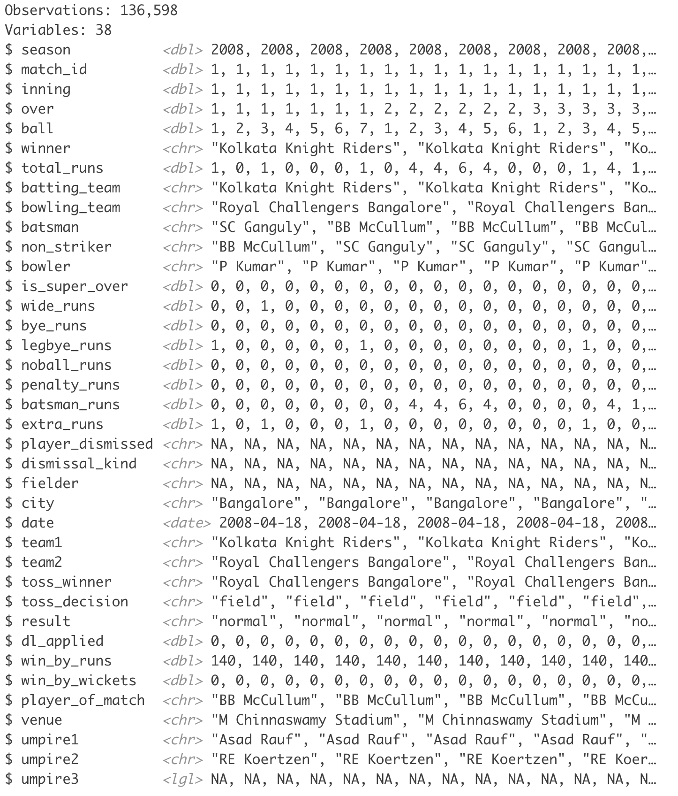
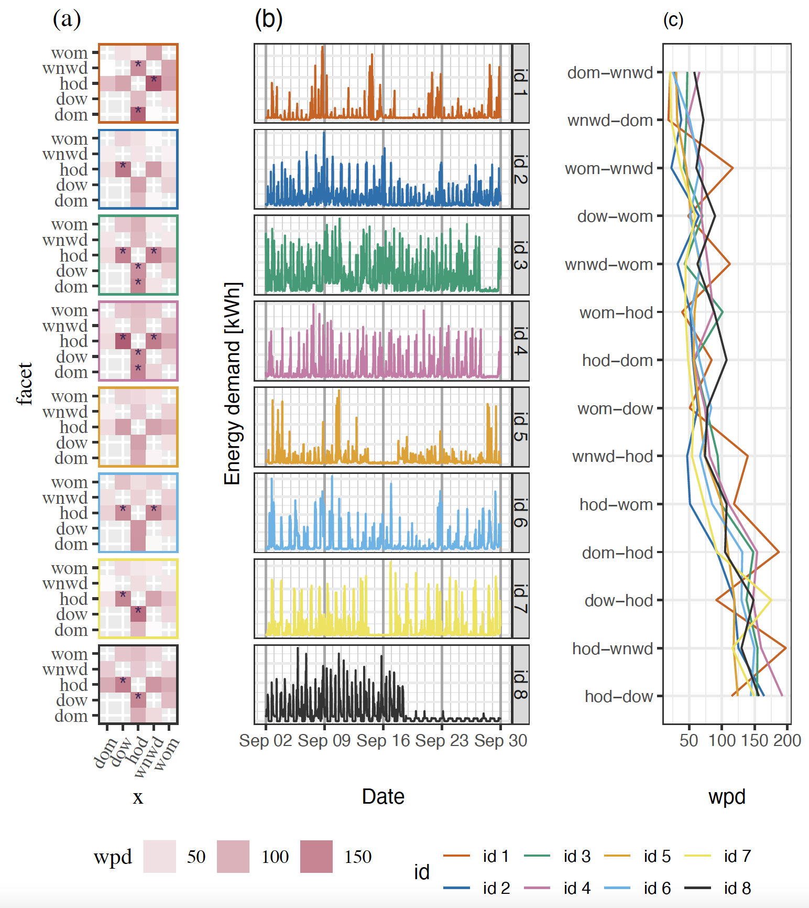

```{r setup, include=FALSE}
library(knitr)
options(htmltools.dir.version = FALSE, tibble.width = 55, tibble.print_min = 4)
opts_chunk$set(
  echo = FALSE, warning = FALSE, message = FALSE, comment = "#>",
  fig.path = 'figure/', cache.path = 'cache/', fig.align = 'center', 
  fig.width = 12, fig.show = 'hold', fig.height = 7, # 16:9
  cache = TRUE, external = TRUE, dev = 'svglite',
  results = "markup"
)
read_chunk('R/theme.R')
read_chunk('R/main.R')
```

```{r xaringan-themer, include = FALSE, eval=FALSE}
library(xaringanthemer)
 solarized_dark(
   header_font_google = google_font("Josefin Sans"),
   text_font_google   = google_font("Montserrat", "300", "300i"),
   code_font_google   = google_font("Droid Mono"),
   # header_color = "#00aba9",
   # text_color = "#2b5797"
   # # header_color = "#00008B",
   # text_color = "#8B4513"
  header_color = "#ffbb33",
  # text_color = "#FFDAB9",
  text_color = "White",
  background_color = "#555555",
  #title_slide_background_color = " #D9D690"
 )
```


```{r titleslide, child="components/titleslide.Rmd"}
```

---

```{r load}

```

# Outline

.pull-left[
.checked[
- .larger[Why?]  
<br>
- .larger[What?]    
<br>
- .larger[How?]  
   _Methods, Package usage_
]
]

.pull-right[
.animated.bounce[

]
]

<br>

.footnote[
_Methodology references_

.smaller[.smaller[.smaller[Gupta, S., Hyndman, R.J., Cook, D. and Unwin, A., 2022. Visualizing probability distributions across bivariate cyclic temporal granularities. Journal of Computational  
and Graphical Statistics, 31(1), pp.14-25]]]

.smaller[.smaller[.smaller[Gupta, S., Hyndman, R.J. and Cook, D., 2021. Detecting Distributional Differences Between Temporal Granularities for Exploratory Time Series Analysis (No. 20/21).  
Monash University, Department of Econometrics and Business Statistics.]]]
]
---
# Why? 

```{r load-elecnew, message = FALSE, warning=FALSE}
```

```{r elec-rawnew, out.width="90%"}

```

.center[
.card[.smaller[Electricity demand series]]
.card[.smaller[many households]]
.card[.smaller[fine time resolutions]]
.card[.smaller[many measurements]]
.card[.smaller[no pattern visible in the squeezed linear view]]
.card[.smaller[different start and end date]]
.card[.smaller[missing observations]]
]


---
# Why? (continued)

<br>

.center[**To provide methods to better understand patterns of these sort of large quantities of time series data that are observed more than once per year**]

.footnote[.smaller[.smaller[
Applicable to any temporal data collected more than once a year

- traffic sensors, pedestrian movement data in metro stations, public buildings,
cab or bike rides

or more broadly,

-  temporal data observed by years, decades, and centuries

or,

- non-temporal data with a hierarchical nested ordering similar to time.

]]]
---

# What? 

<br>

<br>

.center[Visualize and analyze **probability distributions** to explore large quantities of temporal data across different **time deconstructions** to find **underlying patterns ** in behavior.]

???
Why probability distributions? Which time deconstructions can help find underlying patterns?

---
# What? (continued)

.pull-left[

.smaller[**Which time deconstructions can help identifying patterns?**  

Cyclic granularities: e.g. hour-of-day, day-of-month or  hour-of-week, day-of-semester]
    <br>
    <br>
 .smaller[**Why probability distributions?**  
 
   Multiple observations for each level of cyclic granularity  
   summarize distribution of measured variables]
 
]

.pull-right[
```{r linear2cyclic, dev='png', interval=0.2}
```
]
---

# How? (package functions)

.smaller[
 
.pull-left[

### 1. Compute and search
--- 
- Compute any cyclic granularity? `create_gran()`
 <br>
- Exhaustive list of granularities to explore? `search_gran()`
 <br>
 
### 2. Interaction
--- 
_.smaller[refine search]_
- Check if cyclic granularities are harmonies/clashes? `is.harmony()`
<br>
- List of harmonies to explore? `harmony()`
<br>]

.pull-right[
### 3. Inference 
--- 
_.smaller[refine search further]_
- Select and rank only interesting displays? `select_harmonies()`
<br>

### 4. Visualization 
--- 
_.smaller[investigation of interesting displays]_
- Plot? `prob_plot()`
<br>
- Sufficient observations? `gran_obs()`
<br>
- Recommendations on feasibility? `gran_advice()`
<br>
]
]
---

class:left, top

#  Interaction between cyclic granularities

```{r clash, out.width="100%"}
```
```{r noclash, out.width="100%"}
```

```{r bothclash2, out.width="80%"}
```

.smaller[
.card[_Clashes_: pairs leading to empty sets]
.card[_Harmonies_: pairs leading to no empty sets]  
.smaller[
]
]

---
# Application: Non-temporal case
.left-column[
## Cricket example
.checked[
* data structure
<br>
<br>
* Hierachy table
```{r hierarchy2}
```
]
]
.right-column[
```{r cricket-glimpse}

```
]
---

<!-- SLIDE 9 -->
.left-column[
## Cricket example
```{r cricket-load}

```

.checked[
* data structure
* search granularities `search_gran()`
]
]
.right-column[

```r
cricket_tsibble <- cricket %>%
*  mutate(data_index = row_number()) %>%
*  as_tsibble(index = data_index)
```

```r
* cricket_tsibble %>%
*  search_gran(hierarchy_model, 
*              lowest_unit = "ball",
*               highest_unit =  "match")
```
.pull-left[
```{r search_gran_cric}
```
]
.pull-right[
<br>
<br>
.smaller[
- There are $^{6} P_2$ =  `r length(combn(6,2))` pair of granularities to look at
- 30 visualizations to interpret?
]
]
]
---

.left-column[
## Cricket example
.checked[
* data structure
* search granularities `search_gran()`
* set of harmonies `harmony()`
]
]
.right-column[
```r
cricket_tsibble %>%
*  harmony(hierarchy_model, 
*          lgran = "ball",
*          ugran =  "match")

```

```{r harmony_gran_cric}
```
.smaller[
- only 7 out `r length(combn(6,2))` are harmonies<br>
- plotting other 23 pairs lead to empty combinations
]
]
---

.left-column[
## Cricket example
.checked[
* data structure
* search granularities `search_gran()`
* set of harmonies `harmony()`
* advice `gran_advice()`
]
]
.right-column[

```r
cricket_tsibble %>% 
*  gran_advice("hierarchy_model",
*              "over_inning", 
*              "inning_match")
```
<small>
```{r gran-advice_cric, out.width="100%"}
```
</small>
### <large>  Quantile plots recommended for the harmony pair (over_inning, inning_match) </large>
]
---
.left-column[
## Cricket example
.checked[
* data structure
* search granularities `search_gran()`
* set of harmonies `harmony()`
* advice `gran_advice()`
* visualize harmonies `prob_plot()`
]
]
.right-column[
```r
cricket_tsibble %>% 
filter(batting_team %in% c("Mumbai Indians",
                           "Chennai Super Kings")) %>%
* prob_plot("inning_match",
*            "over_inning",
*            response = "runs_per_over",
*            hierarchy_model,
*            plot_type = "lv")
```

```{r visualise_cric}
```
]
---
#  Melbourne households example: compare households
.left-column[
.checked[
.smaller[
- Ensemble plot with a heatmap (a), line plot (b), parallel coordinate plot (c)
- (a) and (b) display the household ids in the same order 
- (a) shows wpd values across harmonies with significant harmony is shown with an asterisk
- (c) compares households across harmonies.
]
]
]
.right-column[
```{r, out.width="73%"}

```
]

---
class: center, left

## More Information

Package : https://github.com/Sayani07/gravitas  
Slides : https://gravitas-dicookaward.netlify.app/  
Code: https://github.com/Sayani07/dicookaward-talk

<br>

## My Contact Details

gupta.sayani@gmail.com  
https://github.com/Sayani07  
https://sayani.netlify.app/

<br>

## Joint work with

Professors Dianne Cook & Rob J Hyndman


